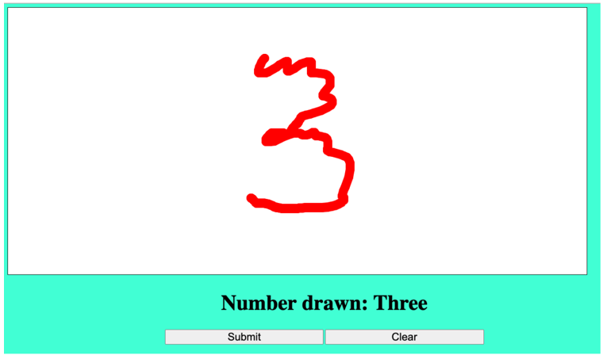
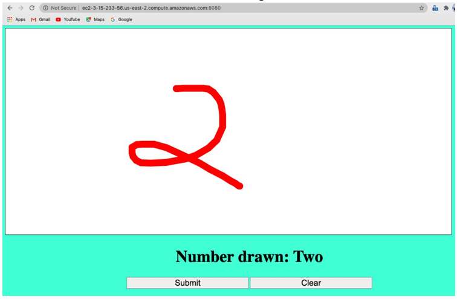
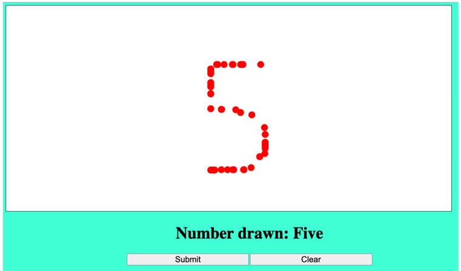
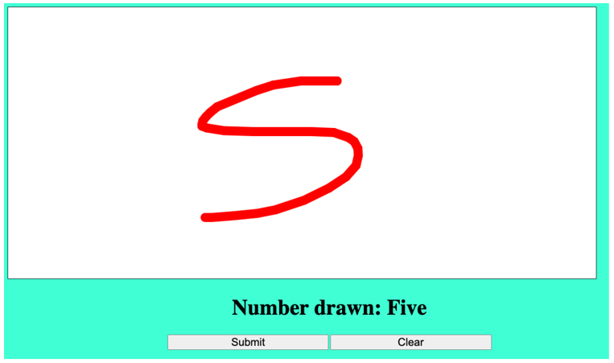
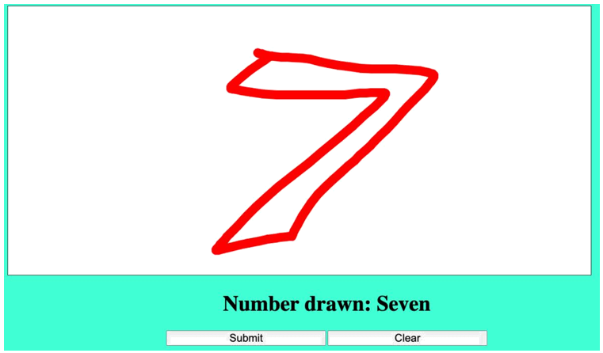
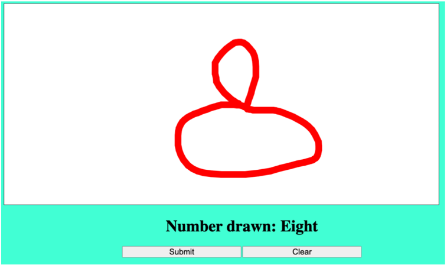
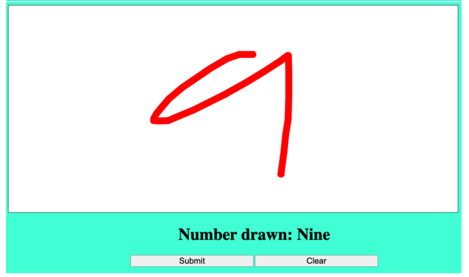

# Digit-Recognizer-App

The motivation behind this project was to "Deploy a deep learning model as Web Application".

In this project, an application was deployed on AWS server which lets user to draw a digit/number (handwritten digit) in the front end and with the help of trained Deep learning model (CNN) in the back-end, the number gets recognized by the application correctly.

CNN model was tuned by testing it on the worst possible handwritten digits we could give, model performed exceptionally well on the real handwritten digits.

**How to build and deploy the project:** You will need to generate and download RSA private key(.pem). Along with the above project, you will have to get the private key to try it on your own.

As said above model was tuned to recognize the digits in worst handwritting and should be able to recognize and display the number with which it is matching the most. Above attached fianal_report.pdf has detailed explanation.

Few results of the AWS deployed Digit Recognizer Application:

Format: 

Format: 

Format: 

Format: 

Format: 

Format: 

Format: 

Format: 
